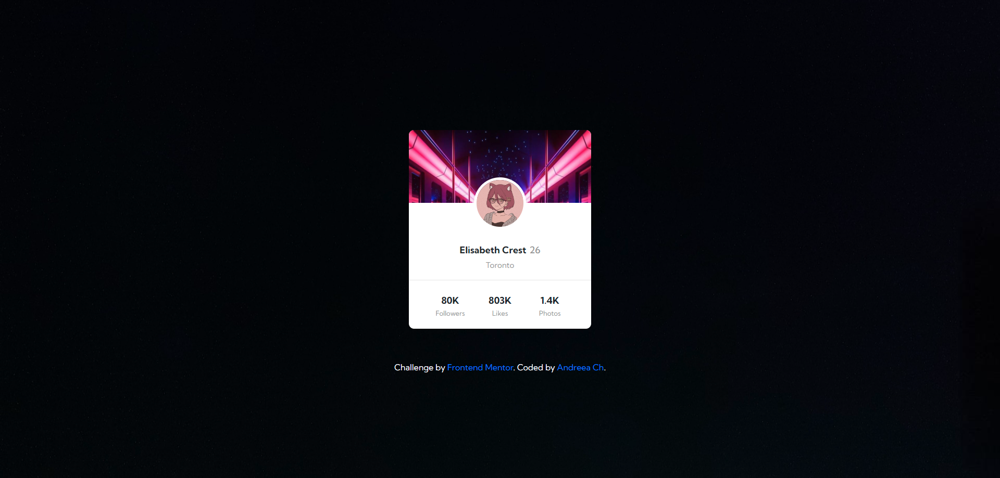
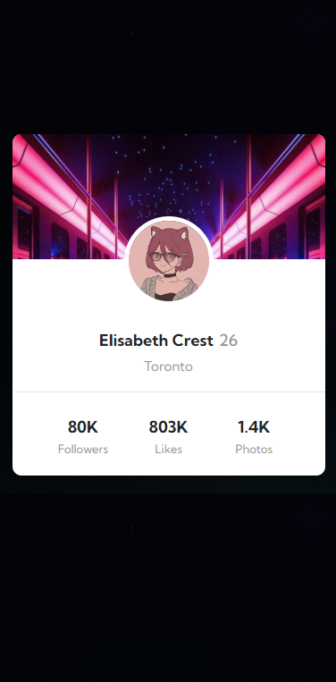

# Frontend Mentor - Profile card component solution

This is a solution to the [Profile card component challenge on Frontend Mentor](https://www.frontendmentor.io/challenges/profile-card-component-cfArpWshJ). Frontend Mentor challenges help you improve your coding skills by building realistic projects. 

## Table of contents

- [Overview](#overview)
  - [The challenge](#the-challenge)
  - [Screenshot](#screenshot)
  - [Links](#links)
- [My process](#my-process)
  - [Built with](#built-with)
  - [Other tools used](#other-tools-used)
  - [What I learned](#what-i-learned)
  - [Useful resources](#useful-resources)


## Overview

### The challenge

- Build out the project to the designs provided

### Screenshot




### Links

- Solution URL: [https://github.com/andr-ch/Profile-card-component.git](https://github.com/andr-ch/Profile-card-component.git)
- Live Site URL: [https://andr-ch.github.io/Profile-card-component/](https://andr-ch.github.io/Profile-card-component/)

## My process

### Built with

- Semantic HTML5 markup: Ensuring the structure of the HTML is meaningful and accessible.
- CSS custom properties: Using variables for maintaining design consistency and easier theming.
- Bootstrap 4.6.2: Leveraging Bootstrap for responsive design and component styling.
- Flexbox: For creating flexible and efficient layout structures.
- Mobile-first workflow: Designing with mobile users in mind first, then scaling up for larger screens.
- Google Fonts: Utilizing custom fonts from Google Fonts (Kumbh Sans).

### What I learned

1. **Using Bootstrap to Create a Responsive Layout:**
```html
<div class="stats row">
    <div class="stat-item col-4">
        <h2>80K</h2>
        <p>Followers</p>
    </div>
    <div class="stat-item col-4">
        <h2>803K</h2>
        <p>Likes</p>
    </div>
    <div class="stat-item col-4">
        <h2>1.4K</h2>
        <p>Photos</p>
    </div>
</div>
```
  Here I used:
-`col-4` : to divide the .stats section into three equal columns, ensuring a responsive layout across different screen sizes.


2.**Creaing a Wrapped Effect of the Header and Profile Picture:**
 ```css
.profile-pic {
    border: 5px solid #fff;
    border-radius: 50%;
    width: 100px;
    height: 100px;
    position: absolute;
    top: 24%;
    left: 50%;
    transform: translateX(-50%);
}
```
Here I used:
- `border: 5px solid #fff;`: Adds a 5px white solid border around .profile-pic for a clear boundary against its background.
- `transform: translateX(-50%);`: Centers the .profile-pic horizontally by translating it 50% of its own width to the left.


### Useful resources

- [Bootstrap Documentation ](https://getbootstrap.com/docs/4.6/getting-started/introduction/) - This helped me understand how to use Bootstrap's grid system and utility classes effectively. It was particularly useful for organizing content and ensuring responsiveness across different screen sizes.

- [Google Fonts](https://fonts.google.com/) - This resource was invaluable for integrating custom fonts into my project. I used the Inter and Lexend Deca fonts, which greatly enhanced the visual appeal of my webpage.

- [CSS Tricks ](https://css-tricks.com/snippets/css/a-guide-to-flexbox/) - This article on Flexbox helped me understand how to align and distribute space among items in a container, which was essential for styling my stats section and ensuring it looked good on all devices.

- [MDN Web Docs on CSS Media Queries](https://developer.mozilla.org/en-US/docs/Web/CSS/CSS_media_queries/Using_media_queries) - This resource was crucial for learning how to apply different styles based on screen size. It allowed me to create a responsive design that adapts to various screen resolutions.

- [CSSmatic - Border Radius Generator ](https://www.cssmatic.com/border-radius) - Helpful for experimenting and generating CSS styles such as border radius, box shadow, and more.


